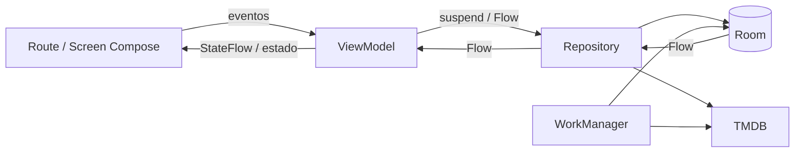

# Arquitectura de Visto

## Alcance y restricciones

Visto es una aplicación Android de un único módulo (`:app`) para registrar películas, series, temporadas, episodios, puntuaciones, notas y listas. La evolución debe preservar:

- `applicationId = "com.dwightsckrute.visto"`, para mantener acceso a los datos privados de la instalación actual.
- El namespace Kotlin histórico `com.dwightsckrute.visto`, hasta que exista una migración dedicada.
- La identidad de firma de las versiones publicadas.
- La base Room `visto.db`, sus migraciones explícitas y los formatos de copia de seguridad.
- Español e inglés, incluido el idioma enviado a TMDB mediante `AppLanguage.tmdbLanguage()`.

Este documento describe el estado auditado el 17 de agosto de 2026. Antes de un cambio estructural, leer también `AGENTS.md`.

## Tecnología y versiones observadas

| Área | Versión o implementación |
| --- | --- |
| Kotlin | 2.3.20 |
| Java | 17 en el proyecto y GitHub Actions |
| Android Gradle Plugin | 9.1.0 |
| Gradle wrapper | 9.3.1 |
| compileSdk / targetSdk / minSdk | 36 / 36 / 24 |
| Compose BOM declarado | 2026.03.01 |
| Material 3 resuelto | 1.5.0-alpha17 |
| Navigation Compose | 2.9.7 |
| Lifecycle | 2.10.0 |
| Room | 2.8.4, KSP y esquema 34 |
| Hilt | 2.59.2 |
| WorkManager | 2.11.2 |

`dependencyInsight` confirma que Material 3 se resuelve a `1.5.0-alpha17`. También muestra que dependencias transitivas de MaterialKolor 4.1.1 elevan parte de Compose a `1.11.0-beta02`, por encima de lo fijado por el BOM. El proyecto compila, pero la alineación debe revisarse como una tarea independiente antes de actualizar Compose o Material 3.

## Estructura actual

```text
app/src/main/java/com/dwightsckrute/visto/
├── core/
│   ├── di/              # proveedores Hilt
│   ├── model/           # modelos compartidos
│   ├── network/         # Retrofit/TMDB y DTO de tendencias
│   ├── prefs/           # preferencias y estado global
│   ├── ui/
│   │   ├── components/  # componentes y piezas de medios
│   │   ├── localization/# idioma y localized(es, en)
│   │   ├── navigation/  # NavHost, rutas y transiciones
│   │   ├── snackbar/    # host y coordinador de mensajes
│   │   └── theme/       # color, tipografía, formas y tema
│   └── utils/
├── data/
│   ├── local/           # Room: entidades, DAO, mappers y migraciones
│   └── repository/      # acceso a Room y TMDB
└── feature/             # home, search, movie, tv, lists, setting, person y shared
```

La dirección general es adecuada para el tamaño de Visto: organización por feature, un módulo y dependencias compartidas en `core`/`data`. No se propone Clean Architecture, múltiples módulos ni una capa de casos de uso por defecto.

## Flujo de datos actual



Los repositorios ya median la mayoría del acceso a Room y TMDB, y varios ViewModels exponen `StateFlow`. `HomeScreenViewModel` es un buen ejemplo: combina fuentes Room y expone un `HomeUiState` inmutable.

## Hallazgos concretos

### Estado y UI

- Hay 199 archivos Kotlin y alrededor de 189 composables, pero no existe ninguna `@Preview`.
- Solo existen dos tests de plantilla. No hay pruebas reales de ViewModels, repositorios, migraciones, copias ni Compose.
- Seis archivos todavía usan `collectAsState()` en rutas donde conviene evaluar `collectAsStateWithLifecycle()`. (Otros dos solo arrastraban el import; corregido en 1.9.0.)
- `MainScreenNavViewModel` guarda el destino principal en `mutableIntStateOf`; no modela destinos ni back stacks y la pantalla cambia mediante un `when`.
- Muchas piezas visuales reciben `NavController` directamente. Debe mantenerse en routes/screens y sustituirse gradualmente por callbacks en componentes reutilizables.
- `SearchScreenContent.kt` (422 líneas), `HomeScreen.kt` (406) y `SettingsScreen.kt` (379) mezclan demasiadas piezas visuales en un archivo. No justifican un movimiento masivo, pero sí extracciones pequeñas por responsabilidad.
- `ExportImportData.kt` y `MetadataSync.kt` viven en `feature/setting` y acceden directamente a base de datos/red. Son coordinadores de datos, no composables puramente visuales; su extracción requiere pruebas de compatibilidad de copia y no se hará como limpieza incidental.
- ~~`SettingsScreen.kt` usa el constructor obsoleto `Locale(String, String)`.~~ Corregido en 1.9.0 con `Locale.forLanguageTag`.

### Navegación

- `AppNavHost` centraliza las rutas y aplica transiciones coherentes, pero aún usa rutas string con argumentos manuales.
- Los tres destinos principales se representan mediante `HorizontalFloatingToolbar` y `ToggleButton`. Visualmente funciona, pero una toolbar representa acciones contextuales, no destinos persistentes.
- El estado de Inicio/Películas/Series no son tres back stacks independientes; cambiar de sección recompone el contenido seleccionado y no conserva navegación interna por destino.
- `Scaffold` solo aplica el padding superior al contenido principal. El padding inferior se resuelve manualmente en varias pantallas, lo que puede duplicarse o quedar corto con barras, IME e insets.

### Sistema visual y movimiento

- Ya existe una base válida en `core/ui/theme`: Material Expressive, Google Sans Flex, MaterialKolor, color dinámico, temas claro/oscuro y OLED.
- ~~`ShapeRadius` ya concentra radios, pero `MaterialExpressiveTheme` no recibe una escala `Shapes` propia.~~ Resuelto en 1.9.0: `AppShapes` deriva de `ShapeRadius` y se pasa al tema.
- ~~No hay tokens compartidos de espaciado, elevación o motion.~~ Resuelto parcialmente en 1.9.0: existen `Spacing`, `Elevation` y `AppMotion`, con consumidores reales. La migración del resto de literales es progresiva, al tocar cada pantalla.
- Algunas medidas responden a contenido real (carátulas, touch targets), mientras otras son variaciones arbitrarias que deben converger al tocar cada pantalla.
- ~~Las transiciones de navegación usan duraciones locales de 350/200 ms.~~ Ahora usan `AppMotion`. Siguen sin reutilizar `MaterialTheme.motionScheme`, que es la opción preferente cuando la transición lo permita.
- La barra actual coordina varias animaciones independientes (`animateContentSize`, `Crossfade`, `AnimatedVisibility`). Debe sustituirse por una transición de estado única al crear la navegación semántica.

### Dependencias y calidad

- ~~Material 3 está declarado dos veces: una entrada gobernada por BOM y otra fijada a `1.5.0-alpha17`.~~ Corregido en 1.9.0: se conserva solo la entrada fijada, que es la que ya resolvía. `dependencyInsight` confirma que la resolución no cambió.
- El catálogo fija Foundation/Animation 1.10.6, pero la resolución incluye artefactos Compose 1.11.0-beta02 por dependencias transitivas. No se debe modificar sin una matriz de compatibilidad y compilación completa.
- No hay ktlint ni Detekt configurados. Los comandos reales son los documentados en `AGENTS.md`; no deben inventarse tareas.
- La compilación inicial `:app:compileDebugKotlin` pasó. La única advertencia observada fue el constructor de `Locale` obsoleto.

## Arquitectura objetivo proporcional

La estructura objetivo conserva `core`, `data` y `feature`:

```text
core/ui/
├── components/              # componentes compartidos con API estable
├── localization/
├── navigation/
└── theme/
    ├── Color.kt
    ├── Theme.kt
    ├── Type.kt
    ├── Shape.kt             # evolución de ShapeRadius
    ├── Spacing.kt
    ├── Motion.kt
    └── Elevation.kt

feature/<feature>/
├── <Feature>Route.kt        # ViewModel, lifecycle y navegación
├── <Feature>Screen.kt       # UI preferentemente stateless
├── <Feature>UiState.kt
├── <Feature>ViewModel.kt
└── components/
```

No es obligatorio crear todos esos archivos en cada feature. Una extracción se justifica cuando reduce responsabilidad, permite preview/test o evita duplicación.

### Responsabilidades

- **Route:** obtiene ViewModels, recoge `StateFlow` con lifecycle, convierte efectos puntuales y callbacks de navegación.
- **Screen:** recibe estado inmutable y callbacks; muestra loading, empty, content y error.
- **Component:** recibe únicamente el estado necesario, `modifier` y eventos; no conoce repositorios, DAO, Retrofit, WorkManager ni `NavController` si es reutilizable.
- **ViewModel:** coordina acciones, expone `StateFlow<UiState>` y efectos puntuales separados cuando sea necesario.
- **Repository:** decide entre Room/red, mapea modelos y mantiene Room como fuente de verdad.
- **Worker/coordinador:** ejecuta backup y sincronización fuera de UI, preservando URI, formato y reintentos.

## Navegación objetivo

1. Definir una lista tipada de tres destinos principales: Inicio, Películas y Series.
2. Mantener listas, ajustes, búsqueda y detalle como destinos secundarios.
3. Construir `AppFloatingNavigationBar` con semántica de navegación. La base debe ser `NavigationBar`/`NavigationBarItem` cuando permita la forma y el indicador requeridos; si no, un contenedor propio debe conservar roles, selección y accesibilidad equivalentes.
4. No reutilizar `HorizontalFloatingToolbar` para destinos. Reservar floating toolbar para acciones contextuales en listas/detalles y FAB para Buscar.
5. Preservar estado por destino con `saveState`, `restoreState` y `launchSingleTop`, o con back stacks dedicados si la experiencia lo requiere.
6. Evaluar diseño adaptativo después de estabilizar compact: `NavigationSuiteScaffold` requiere el artefacto Material 3 Adaptive, que hoy no está instalado. En ancho medio/ampliado, preferir rail o suite en lugar de estirar la píldora.

No se migrará a Navigation 3 solo por modernidad. Navigation Compose 2.9.7 ya soporta predictive back y shared elements; cualquier cambio de librería necesita una propuesta aparte.

## Persistencia y copias

- Room continúa siendo la fuente de verdad.
- Todo cambio de entidad incrementa la versión 34, añade y registra una `Migration`, actualiza esquemas y se prueba desde una base existente.
- Exportación/importación es una API pública: campos nuevos opcionales o formato versionado, con importación retrocompatible.
- Automatic backup conserva URI SAF persistida, permisos, unique work, frecuencia y reintentos.
- Los cambios visuales no deben modificar entidades, serialización ni el nombre de base.

## Estrategia de testing

Prioridad incremental:

1. Tests unitarios puros para mapeo de `UiState` (Home, Search, estado de seguimiento).
2. Tests de ViewModel con repositorios controlados donde aporte valor.
3. Tests Room de todas las migraciones nuevas y, al menos, de la ruta 33→34 existente como referencia.
4. Tests de compatibilidad de export/import antes de tocar su formato.
5. Tests Compose para navegación principal, etiquetas largas, selección y estados vacíos/error.
6. Previews claras/oscuras con datos de muestra para componentes aislados.

## Plan incremental propuesto

### Fase 0 — aplicada en esta tarea

- Documentación permanente, `AGENTS.md` y skills locales.
- Auditoría de arquitectura, UI, dependencias y compilación.
- Sin cambios de comportamiento ni movimientos de código.

### Fase 1 — base visual segura (aplicada en 1.9.0, pendiente de cierre)

Hecho:

- `AppShapes`, `Spacing`, `Elevation` y `AppMotion` creados bajo `core/ui/theme` y conectados a consumidores reales (tema, transiciones de navegación, toolbars flotantes y diálogos), sin cambio de aspecto.
- `Locale` obsoleto corregido y declaración duplicada de Material 3 eliminada tras verificar el grafo.

Pendiente:

- Migrar el resto de literales `dp`/`sp` al tocar cada pantalla.
- Añadir previews claro/oscuro para componentes aislables (el proyecto sigue sin ninguna `@Preview`).

### Fase 2 — navegación principal

- Crear modelo tipado de destinos y `AppFloatingNavigationBar`.
- Separar Buscar como FAB/acción global.
- Integrar insets y edge-to-edge sin padding manual duplicado.
- Añadir tests de selección, restauración y tamaños compactos.

### Fase 3 — pantallas piloto

- Home como piloto cinematográfico: route/screen, resumen, carruseles y estados.
- Search como segundo piloto por su tamaño y complejidad de animación.
- Extraer piezas de Settings sin cambiar backup/import.

### Fase 4 — detalle y continuidad espacial

- Unificar componentes Movie/TV compartidos.
- Evaluar shared elements carátula→detalle con Navigation 2.9.7.
- Integrar predictive back y probar interrupción/recortes.

### Fase 5 — adaptación y deuda de datos

- Evaluar Material 3 Adaptive para rail/suite en ventanas mayores.
- Extraer coordinadores de backup y metadata solo con pruebas de compatibilidad.
- Ampliar tests y decidir si ktlint/Detekt aportan valor antes de añadir plugins.

## Movimientos y extracciones que requieren aprobación

- Reemplazar `MainFloatingToolbar` y cambiar cómo se conserva el estado de destinos.
- Dividir `SearchScreenContent`, `HomeScreen` y `SettingsScreen` en archivos route/screen/components.
- Mover backup, importación y sincronización desde `feature/setting` a data/workers.
- Añadir Material 3 Adaptive o cualquier dependencia/plugin.
- Alinear Compose/MaterialKolor o subir Material 3 desde alpha17.
- Adoptar rutas type-safe o Navigation 3.
- Renombrar el package histórico o la base de datos.

## Riesgos principales

- Pérdida de datos por tocar ID, firma, Room o backups.
- Regresiones de navegación/estado al sustituir el selector basado en `when`.
- Incompatibilidades binarias por el grafo Compose mezclado.
- Overshoot de springs aplicado a padding/tamaño con rangos inválidos.
- Contraste deficiente con color dinámico/OLED y contenido sobre carátulas.
- Clipping con español, font scale alto, pantallas estrechas e insets de gestos.

Cada fase debe ser pequeña, compilable y reversible mediante Git, sin reescribir historial publicado.
